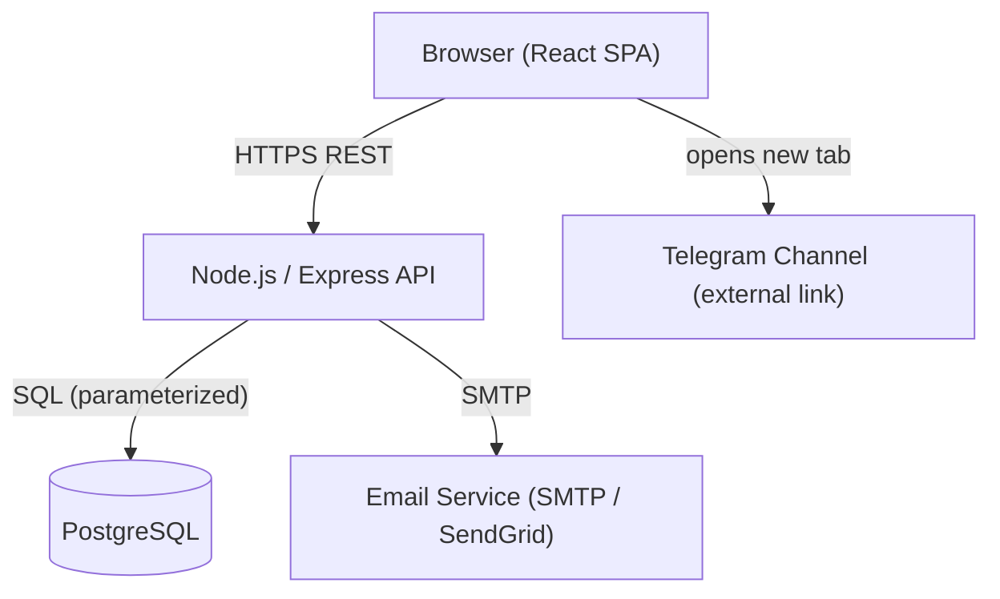

# Design Document: Kansal Sales Website

## Overview

Kansal Sales is a grocery and milk products e-commerce website. The system provides public product browsing, user authentication, a persistent shopping cart, an admin panel for catalog management, and a contact page with a Telegram community link. A `/checkout` route is reserved for a future payment gateway integration.

The architecture follows a classic client-server model: a React SPA (Single-Page Application) communicates with a Node.js/Express REST API backed by a PostgreSQL database. Authentication is session-token based. The admin panel is a protected section of the same SPA, gated by role-based access control.

### Key Design Decisions

- **SPA with React Router**: Enables client-side navigation without full page reloads (Requirement 1.2).
- **Node.js + Express API**: Familiar, lightweight, well-suited for REST endpoints and middleware-based security.
- **PostgreSQL**: Relational model fits products, categories, users, and carts naturally; supports parameterized queries out of the box (Requirement 7.4).
- **JWT session tokens (httpOnly cookies)**: Stateless auth that is XSS-resistant when stored in httpOnly cookies; 24-hour expiry enforced server-side (Requirement 7.2).
- **bcrypt for password hashing**: Industry-standard salted hashing (Requirement 2.9).
- **Decimal(10,2) price field**: Compatible with standard payment gateway amount formats (Requirement 8.3).

---

## Architecture



### Layers

| Layer | Technology | Responsibility |
|---|---|---|
| Frontend | React + React Router + Axios | SPA, routing, UI state |
| API | Node.js + Express | Business logic, auth, validation |
| Database | PostgreSQL | Persistent storage |
| Auth | JWT (httpOnly cookie) + bcrypt | Session management, password hashing |
| Email | Nodemailer / SendGrid | Verification emails, contact form |

### Request Flow (authenticated)

```mermaid
sequenceDiagram
    participant Browser
    participant API
    participant DB

    Browser->>API: POST /api/auth/login {email, password}
    API->>DB: SELECT user WHERE email=?
    DB-->>API: user row
    API-->>Browser: Set-Cookie: token=<JWT>; HttpOnly

    Browser->>API: GET /api/cart (cookie auto-sent)
    API->>API: Verify JWT, extract userId
    API->>DB: SELECT cart WHERE userId=?
    DB-->>API: cart rows
    API-->>Browser: 200 {cart}
```

---

## Components and Interfaces

### Frontend Components

| Component | Route | Description |
|---|---|---|
| `NavBar` | all | Navigation links, cart count badge, auth state |
| `HomePage` | `/` | Banner, description, featured products |
| `ProductsPage` | `/products` | Full product listing with search bar |
| `CategoriesPage` | `/categories` | Category list + filtered product view |
| `ProductCard` | (shared) | Name, image, price, stock status, Add to Cart |
| `CartPage` | `/cart` | Cart items, quantities, totals |
| `LoginPage` | `/login` | Login form |
| `RegisterPage` | `/register` | Registration form |
| `ContactPage` | `/contact` | Contact form + Telegram link |
| `CheckoutPage` | `/checkout` | "Coming Soon" placeholder |
| `AdminLayout` | `/admin/*` | Admin shell with role guard |
| `AdminProductsPage` | `/admin/products` | Product CRUD table |
| `AdminCategoriesPage` | `/admin/categories` | Category CRUD |
| `ConfirmationDialog` | (modal) | Reusable confirm/cancel dialog |

### API Endpoints

#### Auth (`/api/auth`)

| Method | Path | Description |
|---|---|---|
| POST | `/register` | Create user account, send verification email |
| POST | `/login` | Validate credentials, issue JWT cookie |
| POST | `/logout` | Invalidate session (clear cookie) |

#### Products (`/api/products`)

| Method | Path | Description |
|---|---|---|
| GET | `/` | List all products (supports `?search=`, `?category=`) |
| GET | `/:id` | Get single product |
| POST | `/` | Create product (Admin only) |
| PUT | `/:id` | Update product (Admin only) |
| DELETE | `/:id` | Delete product (Admin only) |

#### Categories (`/api/categories`)

| Method | Path | Description |
|---|---|---|
| GET | `/` | List all categories |
| POST | `/` | Create category (Admin only) |
| PUT | `/:id` | Rename category (Admin only) |
| DELETE | `/:id` | Delete category (Admin only) |

#### Cart (`/api/cart`)

| Method | Path | Description |
|---|---|---|
| GET | `/` | Get current user's cart |
| POST | `/items` | Add item to cart |
| PUT | `/items/:productId` | Update item quantity |
| DELETE | `/items/:productId` | Remove item from cart |
| POST | `/checkout` | Checkout initiation — returns order summary |

#### Contact (`/api/contact`)

| Method | Path | Description |
|---|---|---|
| POST | `/` | Submit contact form, send email to admin |

### Middleware

- `authenticate`: Verifies JWT from httpOnly cookie; attaches `req.user`.
- `requireAdmin`: Checks `req.user.role === 'admin'`; returns 403 otherwise.
- `rateLimiter`: Applied to `POST /api/auth/login`; max 10 requests per IP per 15 min.
- `sanitize`: Strips/escapes HTML from all string inputs (XSS prevention).

---

## Data Models

### `users`

```sql
CREATE TABLE users (
  id          UUID PRIMARY KEY DEFAULT gen_random_uuid(),
  email       VARCHAR(255) UNIQUE NOT NULL,
  display_name VARCHAR(100) NOT NULL,
  password_hash VARCHAR(255) NOT NULL,   -- bcrypt hash
  role        VARCHAR(20) NOT NULL DEFAULT 'user', -- 'user' | 'admin'
  email_verified BOOLEAN NOT NULL DEFAULT FALSE,
  created_at  TIMESTAMPTZ NOT NULL DEFAULT NOW()
);
```

### `categories`

```sql
CREATE TABLE categories (
  id    UUID PRIMARY KEY DEFAULT gen_random_uuid(),
  name  VARCHAR(100) UNIQUE NOT NULL
);
```

### `products`

```sql
CREATE TABLE products (
  id           UUID PRIMARY KEY DEFAULT gen_random_uuid(),
  name         VARCHAR(255) NOT NULL,
  description  TEXT,
  price        DECIMAL(10, 2) NOT NULL,   -- payment-gateway compatible
  stock_status VARCHAR(20) NOT NULL DEFAULT 'in_stock', -- 'in_stock' | 'out_of_stock'
  category_id  UUID REFERENCES categories(id) ON DELETE SET NULL,
  image_urls   TEXT[] NOT NULL DEFAULT '{}',
  created_at   TIMESTAMPTZ NOT NULL DEFAULT NOW(),
  updated_at   TIMESTAMPTZ NOT NULL DEFAULT NOW()
);
```

### `cart_items`

```sql
CREATE TABLE cart_items (
  id         UUID PRIMARY KEY DEFAULT gen_random_uuid(),
  user_id    UUID NOT NULL REFERENCES users(id) ON DELETE CASCADE,
  product_id UUID NOT NULL REFERENCES products(id) ON DELETE CASCADE,
  quantity   INTEGER NOT NULL CHECK (quantity > 0),
  added_at   TIMESTAMPTZ NOT NULL DEFAULT NOW(),
  UNIQUE (user_id, product_id)
);
```

### `sessions` (optional — for server-side token invalidation)

```sql
CREATE TABLE sessions (
  token_id   UUID PRIMARY KEY,
  user_id    UUID NOT NULL REFERENCES users(id) ON DELETE CASCADE,
  expires_at TIMESTAMPTZ NOT NULL,
  created_at TIMESTAMPTZ NOT NULL DEFAULT NOW()
);
```

### TypeScript Interfaces (API layer)

```typescript
interface User {
  id: string;
  email: string;
  displayName: string;
  role: 'user' | 'admin';
  emailVerified: boolean;
}

interface Product {
  id: string;
  name: string;
  description: string;
  price: string;          // DECIMAL serialized as string to preserve precision
  stockStatus: 'in_stock' | 'out_of_stock';
  categoryId: string | null;
  imageUrls: string[];
}

interface CartItem {
  productId: string;
  quantity: number;
  price: string;
  name: string;
}

interface Cart {
  userId: string;
  items: CartItem[];
  total: string;
}

interface OrderSummary {
  cartId: string;
  items: CartItem[];
  total: string;
  currency: string;
}
```

---
